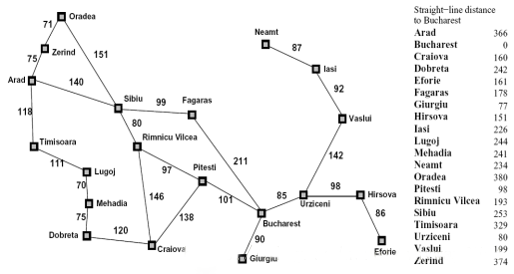

# Romania-Problem
Map of Romania with dictionary
BFS Romania Problem

Breadth First Search(BFS) is used to reach goal from source on the Romanian map.
Path cost to reach the goal is also computed in both the traversals.

